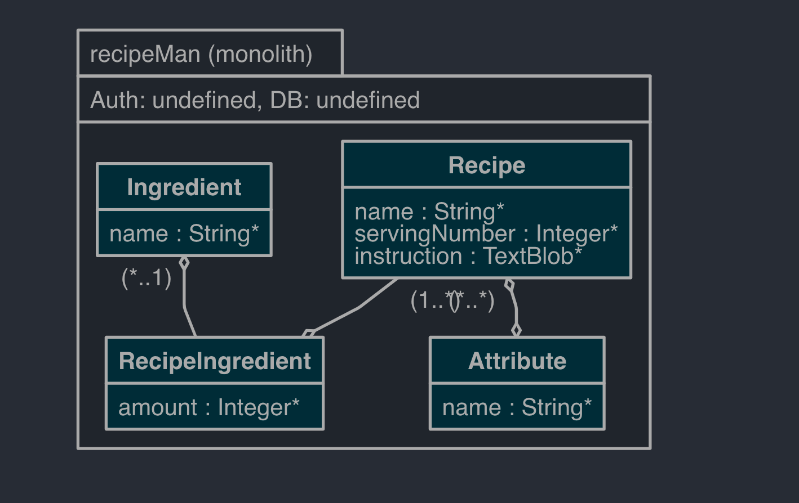

# Getting Started

## Assumptions
- Instruction of Recipe is a simple text. If we need to have ordered instructions for a recipe, we have to change our data model and refactor it.
- I ignored adding spring Security and APIs are open
- Recipe name, Ingredient name and Attribute Type are unique.
- I have replaced the `Vegetarian` in Recipe with `Attribute Type` so we can have more. For example, I have added `Hilal`.
 

## Domain Model

## swagger ui
[http://localhost:8081/swagger-ui/index.html]()

  

## Run
- make sure you have mvn and java in your path 
- package and run application with:
  - `mvn clean package &&  java -jar ./target/RecipeMan-0.0.1-SNAPSHOT.jar`

## Performance Issue
- Using `like` in the query of `Recipe inquiry` is not a correct way, and it has lots of costs and performance issues. The improvement can be by applying caching or using text processing tools.
- Also, in the same query we have 3 joins to find the included, excluded, and attributes (Ex. Vegetarian) required refactoring. For example, because of limited numbers of ingredients and attributes, caching can help us. 

## Test
- Integration Test implemented for 2 controllers

## API Docs
- I only filled a few API docs 